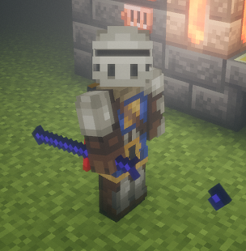
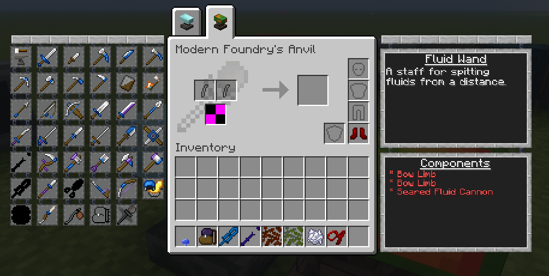
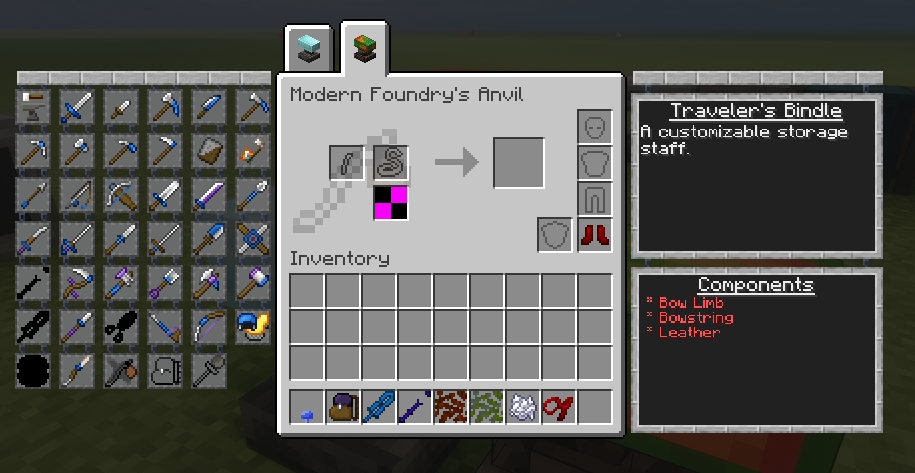
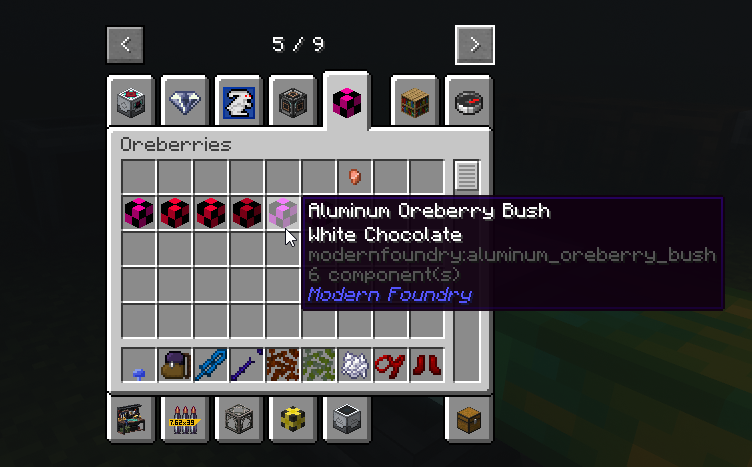

# Bugs

- Slime boots dont bounce the player when equipped

- Quarterstaff is missing an asset section for the items and 3d entity (equipped)

- Missing part slot assets

- dont think backpacks are working as containers 

- Oreberries have broken/missing assets

- Need FTB Ultimine compatability